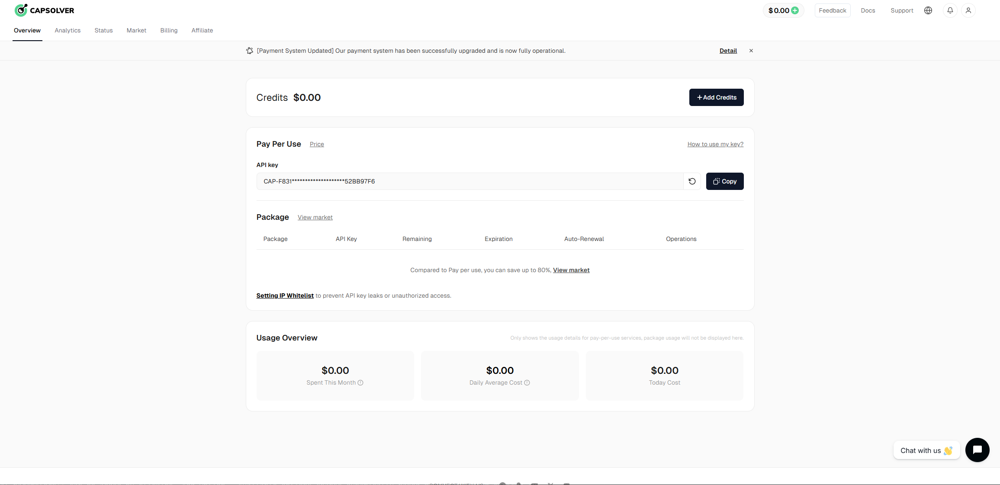
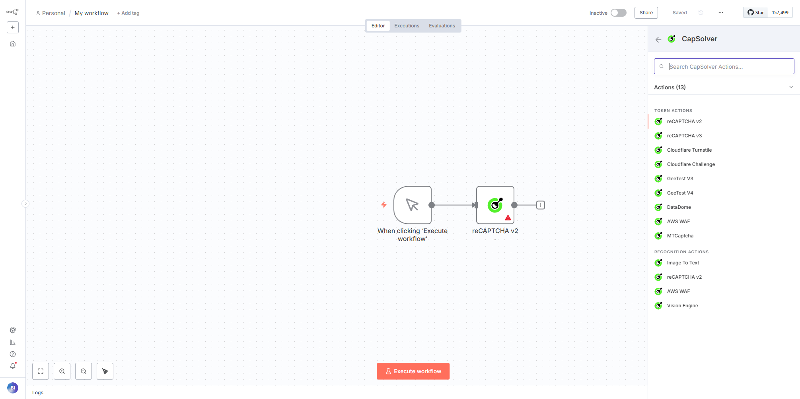
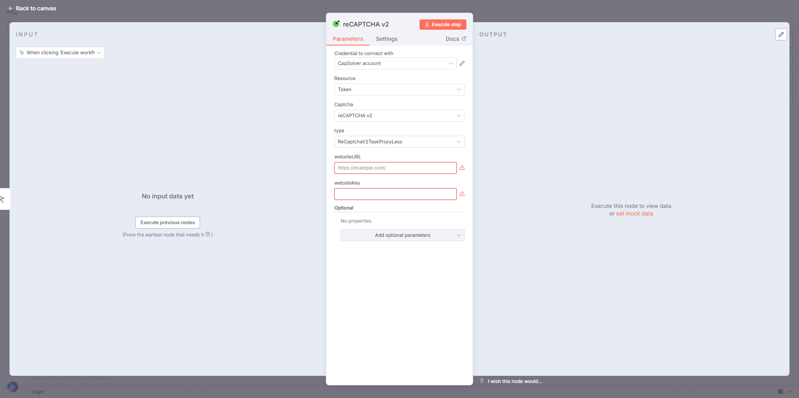

# n8n-nodes-capsolver

This repo contains CapSolver's community node for n8n.

## Installation

Follow the [installation guide](https://docs.n8n.io/integrations/community-nodes/installation/) in the n8n community nodes documentation.

## Credentials

You must have a CapSolver API key to use this node. You can register for a free account to get an API key here:

https://dashboard.capsolver.com/passport/register

Once registered, you can find your API key here:

Then you'll need to create a credential in n8n for CapSolver.

## 🎯 Captcha Type

The following captcha types are supported by this node:

Task(Recognition)
1. ImageToText
2. reCAPTCHA v2
3. AWS WAF
4. VisionEngine

Task(Token)
1. Geetest V3
2. Geetest V4
3. reCAPTCHA v2
4. reCAPTCHA v3
5. Cloudflare Turnstile
6. Cloudflare Challenge
7. DataDome
8. AWS WAF
9. MTCaptcha

## 📖 Usage

Add the CapSolver node to your workflow.

Configure the corresponding parameters, and then click "Execute step".

## 📝 Resources

- [CapSolver](https://www.capsolver.com/)
- [CapSolver Docs](https://docs.capsolver.com/)
- [n8n Community Nodes](https://docs.n8n.io/integrations/community-nodes/)
